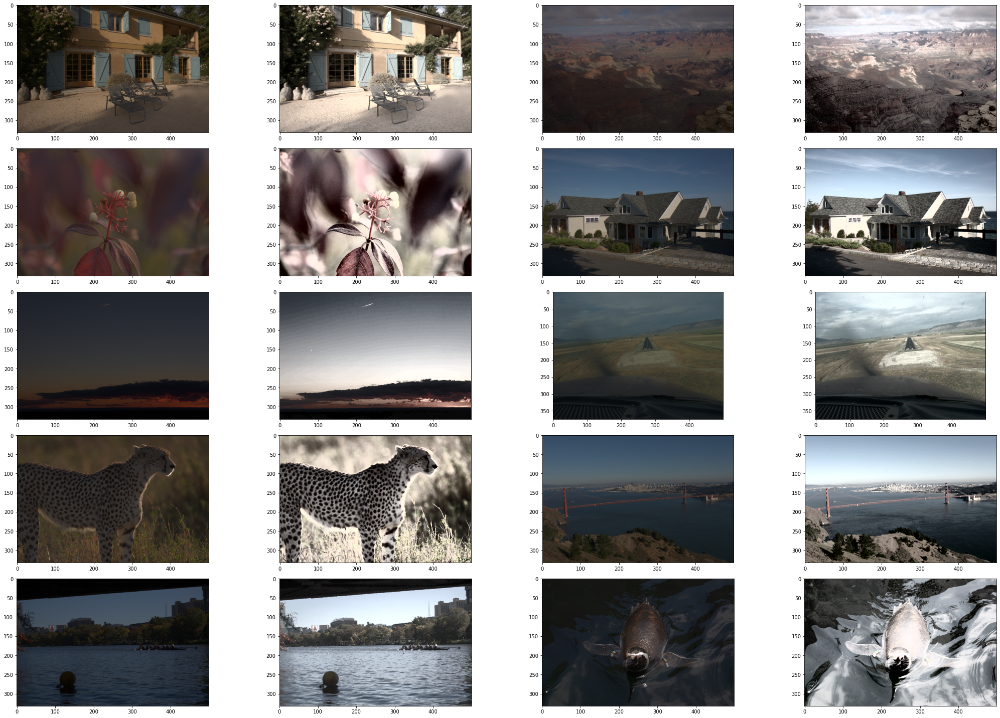
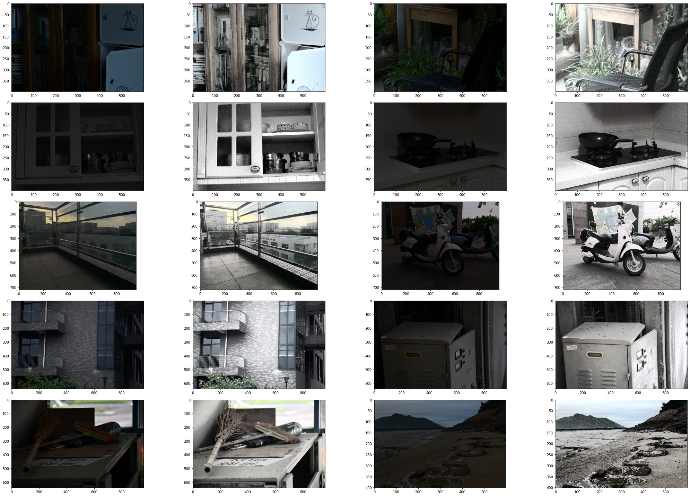
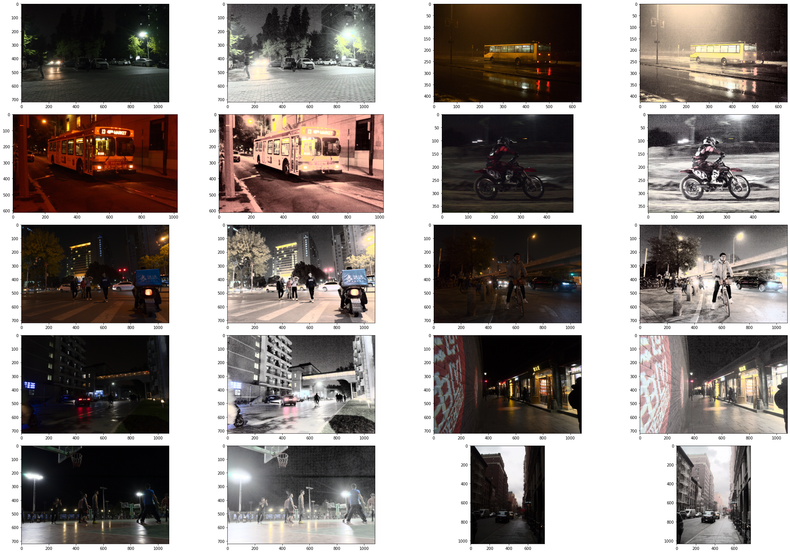
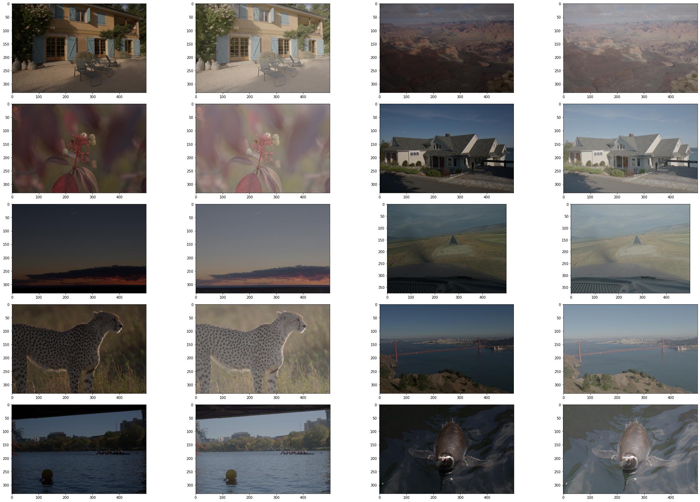
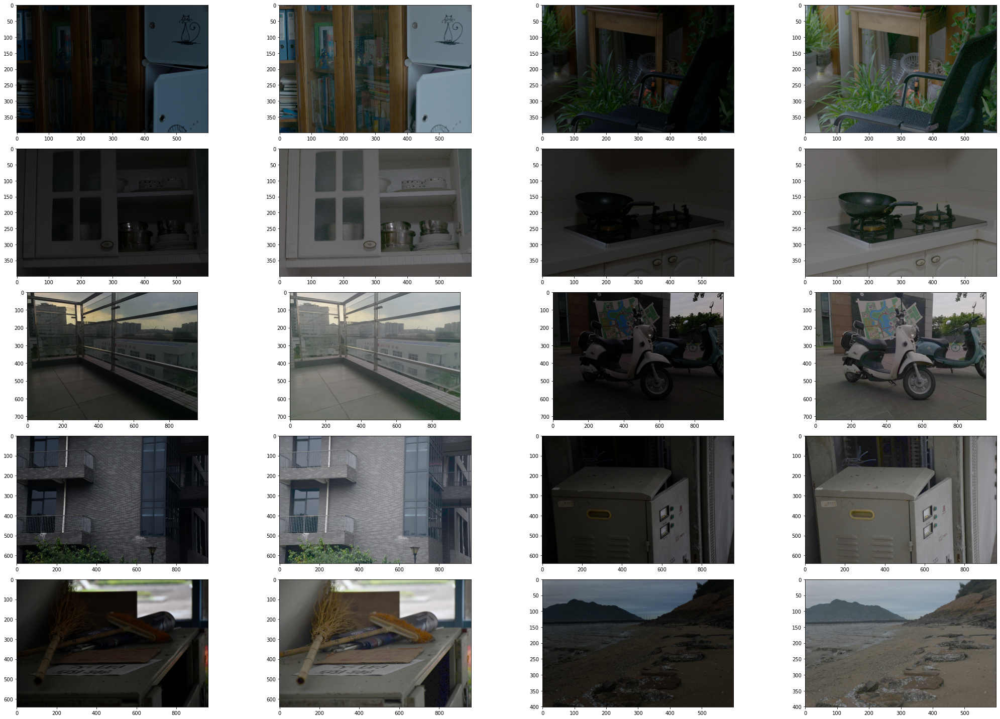
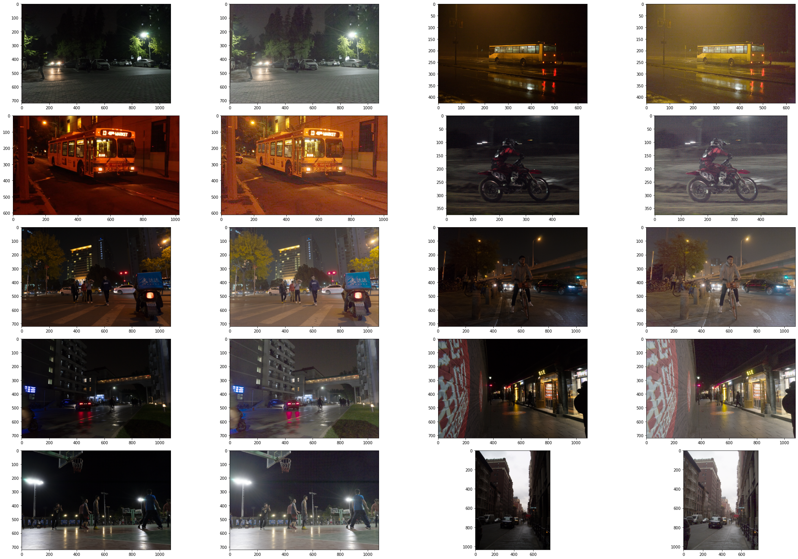
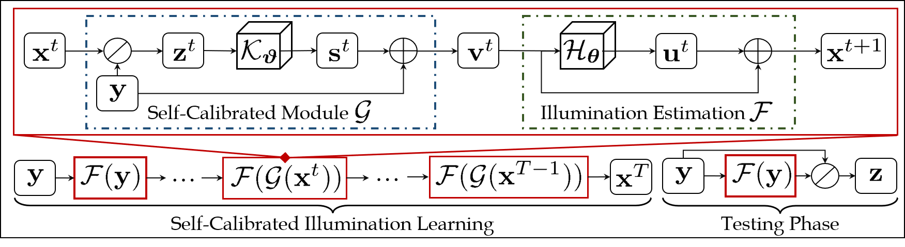

## Comparing the Low Light Image Enhancement Method

### Introduction to Low Light Image Enhancement

​		Images captured in a poor light environment always suffer from low contrast and low visibility, which pose challenges for both human visualization and numerous high level vision tasks such as object detection. **Low-light image enhancement aims at making information hidden in the dark visible to improve image quality.**

​		Low Light Image Enhancement Methods can be roughly divided into two methods: **Model-based Methods** and **Deep Learning-based Methods**. The former is based on **$Retinex$ theory, that is, low-light observation can be decomposed into illumination and reflectance (ie., clear image).** In recent years, convolutional neural networks have made great breakthroughs in many low-level computer vision tasks, and some methods based on CNN have greatly improved the quality of image enhancement. Most of the existing methods are supervised learning. For an original image and a target image, learn the mapping relationship between them to obtain an enhanced image. However, there are relatively few such datasets, and many of them are manually adjusted, so self-supervised or weakly supervised methods are needed to solve this problem.

​		Low-light image enhancement technology has very broad application scenarios, such as: improving the visibility of night inspection or monitoring; improving the effect of real-time streaming media or video chatting in low-light conditions; laying a good foundation for subsequent higher-level image processing.


### What we have done

​		In order to practice what we have learned in this semester course, we have tried some methods that we have learned can be used for low-light image enhancement. They are, Histogram Equalization of Color Image and Gamma Correction.

#### Histogram Equalization of Color Image

​		Histogram equalization is a method to enhance image contrast by stretching the range of pixel intensity distribution. Equalization refers to mapping one distribution (a given histogram) to another distribution (a wider and more uniform distribution of intensity values), so that the distribution of intensity values spreads out over the entire range. 

​		In the book we have learned the histogram equalization method of the gray-scale image. However, the histogram equalization of the color image cannot directly equalize the color components $RGB$ separately, which will produce singular points and the image will be inharmonious. Generally, the $YUV$ space is used to balance the brightness. First we need to convert the color space to $YUV$, then we equalize the histogram of the Y channel, finally we convert the $YUV$ image back to $RGB$ format. The corresponding code is as follows.

```python
def Image_enhancing(image):
    img_yuv = cv.cvtColor(image, cv.COLOR_RGB2YUV)
    # equalize the histogram of the Y channel
    img_yuv[:, :, 0] = cv.equalizeHist(img_yuv[:, :, 0])
    # convert the YUV image back to RGB format
    img_output = cv.cvtColor(img_yuv, cv.COLOR_YUV2RGB)
    return img_output
```

​		We use this algorithm to process three data sets of different difficulty, and the results obtained are as follows:

##### easy:



##### medium:



##### difficult:



​		Each row includes two pairs of images, the first image of each pair is the unprocessed Low-light image, and the second image is the enhanced result. The enhanced image still has the problem of overexposure and color distortion

#### Gamma Correction:

​		Gamma correction is to edit the gamma curve of the image to perform nonlinear tone editing on the image, detect the dark part and light part of the image signal, and increase the ratio of the two, thereby improving the image contrast Effect. First of all, we need to normalize the pixel value of the image, that is, convert it into a real number between $0$ and $1$, and then we use  formula $(1)$ for gamma correction, finally, we restore the gray-scale space of the image.
$$
I_{out}=\frac{1}{c}I_{in}^{\frac{1}{g}},(c=1,g=2.2)\tag{1}
$$
​		The corresponding python code is as follows:

​		

```python
def Image_enhancing(image, c=1, g=2.2):
    img = image.astype(np.float32)
    img /= 255.
    img = (1 / c * img) ** (1 / g)

    img *= 255.
    img = img.astype(np.uint8)
    return img
```

​		We use this algorithm to process three data sets of different difficulty, and the results obtained are as follows:

##### easy:



##### medium:



##### difficult:



​		From the perspective of visual effect, the effect of Gamma Correction is far greater than that of Histogram Equalization.


### what we're going to do

#### Improve Color Image Histogram Equalization Algorithm

​		Ordinary histogram equalization algorithms use the same histogram transformation for the pixels of the entire image. For images with a relatively balanced distribution of pixel values, the algorithm works well. However, if the image includes parts that are significantly darker or brighter than other areas of the image, the contrast in these parts will not be effectively enhanced. That's why the previous enhanced image had issues with overexposure and color distortion.

​		To improve this, we split the image into various regions, and we only calculate the histogram of the specified region rather than the whole region, then we equalize the histogram within each regions. Nevertheless, when a region contains very similar pixel values, its histogram will be sharpened, at this time, the transformation function of the histogram will map the pixels in a very narrow range to the entire pixel range. This will cause small amounts of noise in certain flat areas to be over-amplified.

​		To address this, we can uses contrast clipping for each region, and those parts that exceed the limit range of the histogram will be evenly distributed to other parts of the histogram. As shown below.


​		This redistribution process may cause those clipped parts to re-exceed the clipping value, but this excess is trivial and can be ignored.

#### Self-Calibrated Illumination (SCI) learning framework

​		In this part we will study an Low-Light Image Enhancement article from $CVPR$, named **[Toward Fast, Flexible, and Robust Low-Light Image Enhancement](https://arxiv.org/abs/2204.10137)**

​		This paper develops a self-calibrated module for the illumination learning with weight sharing to confer the convergence between results of each stage, improving the exposure stability and reduce the computational burden by a wide margin. Besides, it defines the unsupervised training loss to constrain the output of each stage under the effects of self-calibrated module, endowing the adaptation ability towards diverse scenes. Its entire framework is as follows:



​		In the training phase, the $SCI$ is composed of the illumination estimation and self-calibrated module. The self-calibrated module map is added to the original low-light input as the input of the illumination estimation at the next stage. Note that these two modules are respectively shared parameters in the whole training procedure. In the testing phase, just utilize a single illumination estimation module.

#### Comparison and Discussion

​		In this section, we report the numerical scores for five types of measurement metrics among three tasks including enhancement ($PSNR$, $SSIM$, and $EME$), detection ($mAP$), and segmentation ($mIoU$), of the Histogram Equalization Algorithm, Gamma Correction and $SCI$ learning framework.

#### Reference

[1] Ma L, Ma T, Liu R, et al. Toward Fast, Flexible, and Robust Low-Light Image Enhancement[C]//Proceedings of the IEEE/CVF Conference on Computer Vision and Pattern Recognition. 2022: 5637-5646.

[2] Pizer S M, Amburn E P, Austin J D, et al. Adaptive histogram equalization and its variations[J]. Computer vision, graphics, and image processing, 1987, 39(3): 355-368.
